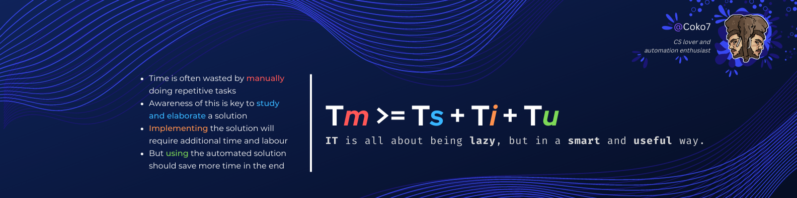

<h1 align="center">Hi, I'm Coko </h1>
<h2 align="center">CS lover and automation enthusiast</h2>

## 🐘 A Little About Me

At my core, I would say I am fundamentaly a <b>lazy</b> and <b>curious</b> person :
 
<ul>
  <li>Lazy because I hate doing the same tedious tasks over and over when I could have an automated system do it in my stead.</li>
  <li>And curious because the world of computer science is both fascinating and very complex and I always want to learn more about it.</li>
</ul>
 
I am amazed by how humans were able to design such complex information systems in so little time. The more I learn about computers, the more I realize <a href="https://en.wikipedia.org/wiki/Dunning%E2%80%93Kruger_effect">how little I know</a> about them.

If only I had enough time to do so, I would love to learn every seperate field of computer science. Whether that be how computers work down to the transistor level, how operation systems are made, what complex problems we have to solve to have a working world wide interconnected network, to the designing of websites, video games, A.I networks and so on.

Up until now, I would say I have mainly worked with web development because that is the easiest way for me to share what I create with others.  Ultimately though, my love about CS is all about how we can leverage the power of computing to solve unbelievably difficult problems.

## 💼 Technical Skills

I have included here the technologies I have used most in my projects.

<!---

--->

### 🌐 Web Development

### 🛠️ Software & Tools Used

### ⚙️ Programming Languages

### 🖥️ Operating Systems

<!---
## 📬 How to reach me

You can contact me using the following:

--->

<!---
Coko7/Coko7 is a ✨ special ✨ repository because its `README.md` (this file) appears on your GitHub profile.
You can click the Preview link to take a look at your changes.
--->
